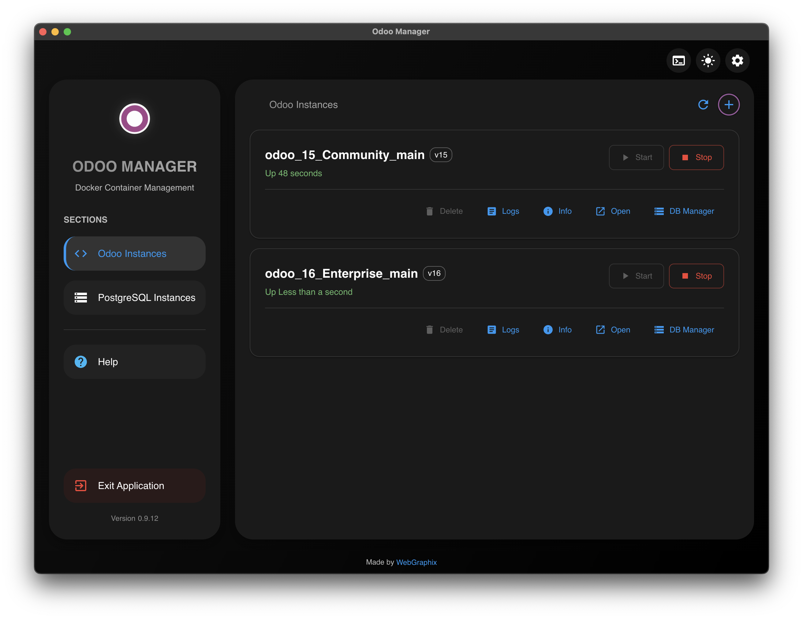
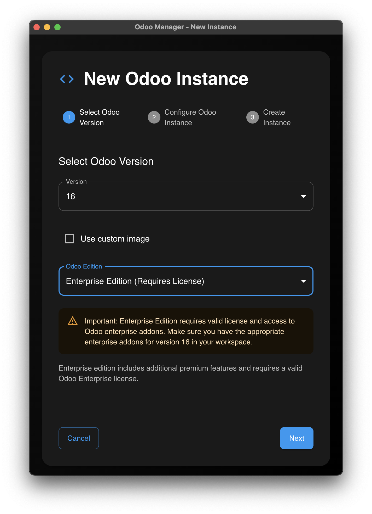
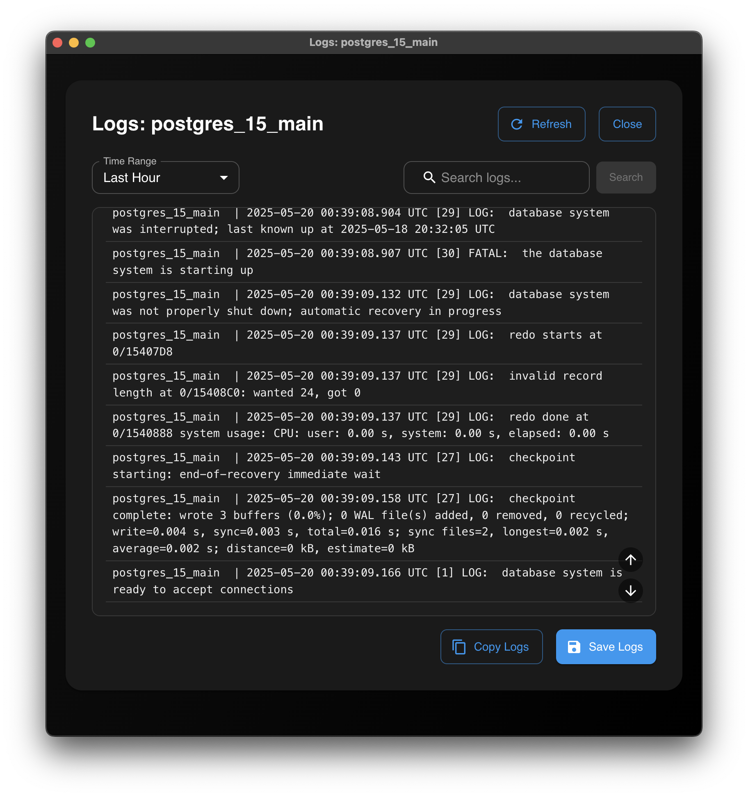
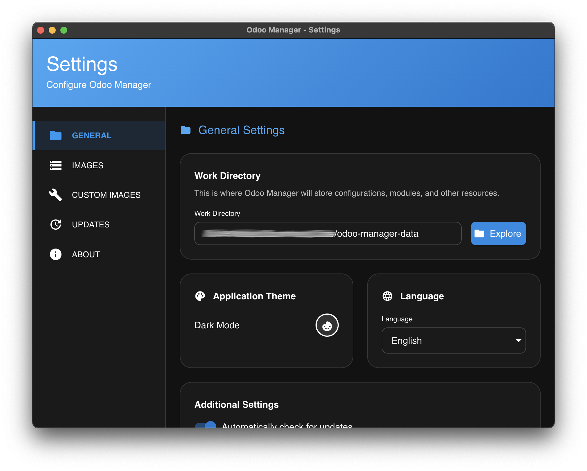

# Odoo Manager

<div align="center">
  
  <h3>A Modern Desktop Application for Managing Odoo Instances with Docker</h3>
</div>

## Overview

Odoo Manager is a cross-platform desktop application built with Electron and React that simplifies the creation, management, and maintenance of Odoo instances using Docker Compose. It provides a user-friendly interface for developers, system administrators, and businesses who want to run multiple Odoo environments locally without dealing with complex Docker commands.

### What is Odoo?

[Odoo](https://www.odoo.com/) is a comprehensive suite of business applications including CRM, e-Commerce, accounting, inventory, point of sale, project management, and more. Each application is designed to work seamlessly with each other, allowing businesses to automate and track all aspects of their operations.

## Features

- **Comprehensive Instance Management**
    - Create, start, stop, and delete Odoo instances with a few clicks
    - Support for both Community and Enterprise editions
    - Choose from different Odoo versions (14, 15, 16, 17, 18, 19)
    - Configure port mappings, database settings, and admin credentials
    - Database filtering options for multi-database deployments

- **PostgreSQL Database Management**
    - Create and manage PostgreSQL database instances
    - Secure credential management with password protection
    - Automatic linking between Odoo and PostgreSQL instances
    - Update database credentials with automatic propagation to dependent Odoo instances

- **Docker Integration**
    - Seamless Docker Compose orchestration
    - Automatic network configuration and volume management
    - Easy access to container logs with time filtering options
    - Custom Docker image support for specialized Odoo deployments

- **Developer-Friendly Features**
    - Direct access to instance configurations
    - Custom module directories automatically mapped
    - Persistent data storage across restarts
    - Enterprise addons support with proper directory structure

- **Modern User Experience**
    - Intuitive interface with smooth animations using Framer Motion
    - Dark and light theme support with system preference detection
    - Real-time container status monitoring
    - Multi-language support (English and Spanish) with easy extensibility
    - Comprehensive error handling and recovery options

## Screenshots


*Main Dashboard showing all instances*


*Creating a new Odoo instance with configuration options*


*Container logs view with filtering options*


*Application settings with customization options*

## Installation

### Prerequisites

- [Docker](https://www.docker.com/get-started) installed and running
- [Docker Compose](https://docs.docker.com/compose/install/) installed

### Download

Download the latest release for your platform:

- [Windows](https://github.com/webgraphix/odoo-manager/releases/latest/download/odoo-manager-win.exe)
- [macOS](https://github.com/webgraphix/odoo-manager/releases/latest/download/odoo-manager-mac.dmg)
- [Linux](https://github.com/webgraphix/odoo-manager/releases/latest/download/odoo-manager-linux.AppImage)

### Development Setup

If you want to run the application from source:

```bash
# Clone the repository
git clone https://github.com/danielmederos2424/odoo-manager.git
cd odoo-manager

# Install dependencies
npm install

# Start the development server
npm run dev
```

### Building Installers

To build installation packages for different platforms:

```bash
# Build for all platforms (macOS, Windows, Linux)
npm run build:all

# Build for specific platforms
npm run build:mac   # macOS only
npm run build:win   # Windows only
npm run build:linux # Linux only (AppImage, DEB, RPM, Pacman)

# Build Linux packages using Docker (recommended for cross-platform builds)
npm run build:linux-docker # Builds all Linux package formats using Docker
```

Note: Cross-platform builds may require additional setup:

- Building for macOS requires a macOS system
- Building for Windows on non-Windows platforms requires Wine
- Building for Linux directly on non-Linux platforms may have limitations
- For complete Linux builds (including RPM and Pacman), use the Docker-based build script

For proper icons across all platforms, place the required icon files in the `build` directory:
- `build/icon.icns` for macOS
- `build/icon.ico` for Windows
- `build/icons/` directory with PNG files for Linux

See `build/README.md` for detailed instructions on preparing icon files.

### Advanced Build Documentation

For comprehensive information on building and publishing releases:

- `BUILD_INSTRUCTIONS.md` - Detailed build process and configuration
- `RELEASE_PROCESS.md` - Step-by-step guide for creating and publishing releases
- `build/generate-icons.sh` - Script for generating platform-specific icons

## Usage

### Setup Process

When you first launch the application, you'll be guided through a one-time setup process:

1. Select your working directory where all Odoo and PostgreSQL configurations will be stored
2. Choose your preferred language and theme
3. Allow the application to verify Docker installation

### Creating a PostgreSQL Instance

1. Launch Odoo Manager
2. Click on "New PostgreSQL Instance" in the sidebar
3. Configure your PostgreSQL instance:
   - Select PostgreSQL version
   - Enter an instance name
   - Configure port (or use automatic port selection)
   - Set username and password
4. Click "Create Instance"

### Creating a New Odoo Instance

1. Launch Odoo Manager
2. Click on "New Instance" in the sidebar
3. Configure your Odoo instance:
   - Select Odoo version (14-19)
   - Choose Community or Enterprise edition
   - Enter an instance name
   - Set an admin password
   - Select a PostgreSQL instance to connect to
   - Enable database filtering if needed
4. Click "Create Instance"

The application will:
- Generate a Docker Compose configuration
- Create necessary directories
- Start the containers
- Provide access details when ready

### Managing Instances

For each instance, you can:
- **Start/Stop**: Control the running state
- **Delete**: Remove the instance and its data
- **View Logs**: See container logs for troubleshooting with time filtering
- **Info**: See detailed information about the instance
- **Open Folder**: Access instance files directly

### Accessing Your Odoo

After creating an instance, you can access it at:
```
http://localhost:PORT
```

Where `PORT` is the port displayed in the instance information.

## Configuration

The application stores all configuration files in the following locations:

- **Windows**: `%APPDATA%\odoo-manager\`
- **macOS**: `~/Library/Application Support/odoo-manager/`
- **Linux**: `~/.config/odoo-manager/`

Each project directory contains:
- `docker-compose.yml`: Container configuration
- `config/odoo.conf`: Odoo configuration file
- `addons/`: Directory for custom modules
- `enterprise/`: Directory for enterprise modules (if applicable)
- `instance-info.json`: Instance metadata

## Architecture

Odoo Manager is built with modern technologies:

- **Electron**: Cross-platform desktop application framework
- **React 19**: UI library with TypeScript
- **Material UI 7**: Modern component library
- **Docker Compose**: Container orchestration
- **Framer Motion**: Animation library
- **i18next**: Internationalization framework

The application follows a modular architecture:

- **Main Process** (Electron): Handles system operations, window management, and IPC communication
- **Renderer Process** (React): Provides the user interface and interaction
- **Services Layer**: Encapsulates business logic and external operations
  - Docker services for container management
  - Settings services for application configuration
  - Path services for file system operations
  - Logger services for comprehensive logging
- **Components**: Modular UI elements organized by functionality
  - Containers for Docker-related components
  - Screens for specific application views
  - Shared components for reuse across the application

## Contributing

Contributions are welcome! Please feel free to submit a Pull Request.

1. Fork the repository
2. Create your feature branch (`git checkout -b feature/amazing-feature`)
3. Commit your changes (`git commit -m 'Add some amazing feature'`)
4. Push to the branch (`git push origin feature/amazing-feature`)
5. Open a Pull Request

### Development Guidelines

- **Code Style**: The project uses ESLint for code quality
- **TypeScript**: All new code should be properly typed
- **Components**: Follow the existing component structure
- **Testing**: Add appropriate tests for new features

## License

See the [LICENSE](LICENSE) file for details.

## Attribution

Odoo Manager is created and maintained by [WebGraphix](https://www.webgraphix.online).

- Odoo is a trademark of Odoo S.A.
- This tool is not officially associated with Odoo S.A.
